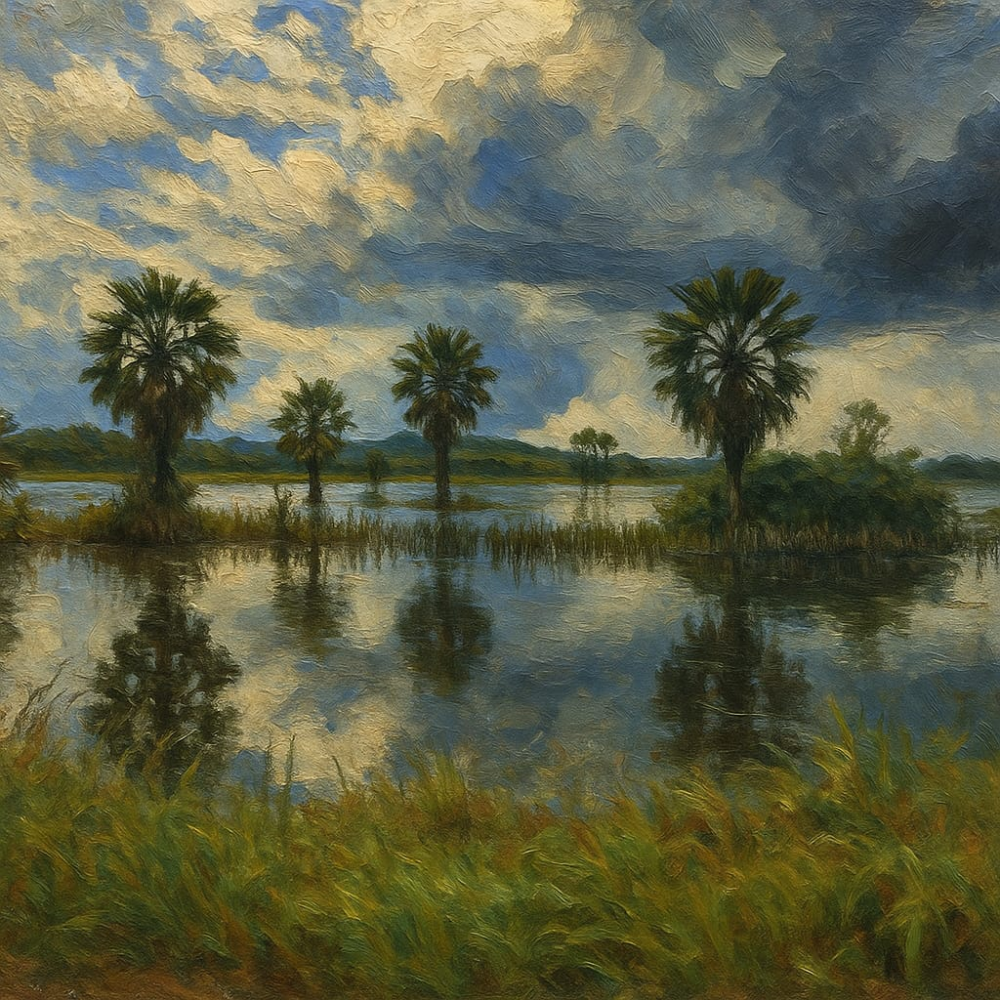

  

  

---

## 🖼️ Destaque

  

---

## 👨‍💻 Sobre mim
🌲 Designer focado em experiências visuais  
💻 Criação de logos, artes digitais e identidade visual  
🎬 Editor de vídeos (CapCut)  
🖌️ Canva + Photoshop  
✨ Evoluindo sempre no design  

---

## 📊 Estatísticas

  
  

---

## 📈 Atividade & Dashboard

  

  

  

  
  

---

## ⚡ Ferramentas

  
  

---

## 🌐 Contato

  
  

---

## 💡 Frase

  

---

  

